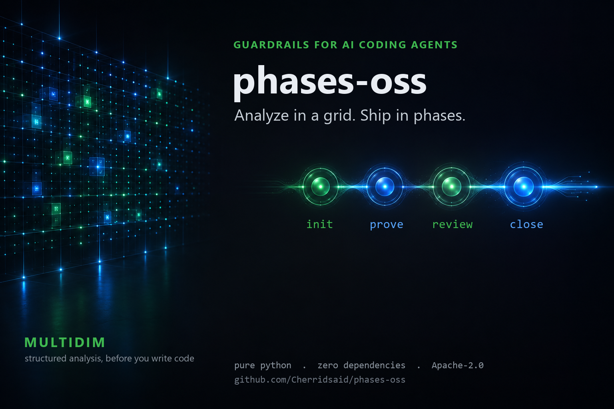

**English** · [Français](README.fr.md)

# phases-oss




A phase-based workflow runner for AI coding agents — bounded phases,
deterministic proofs, a consultative reviewer, and a bundled **Multidim**
analysis engine (structured, multi-axis analysis before you write code).
Pure Python standard library, **zero dependencies**.

`phases-oss` helps an agent (or a person) do risky work in small, verifiable
steps instead of one large, unaudited change.

---

## The idea

Break a task into **phases**. Each phase declares, up front:

| Field | Meaning |
|-------|---------|
| **objective** | one testable goal |
| **files_allowed** | the only files this phase may touch |
| **proof_command** | a reproducible command; exit code 0 = it works |
| **risk level** | `0`–`3`; normalizes the whole policy (see below) |

The **risk level** sets every gate at once (the legacy names `none` /
`review` / `security` / `critical` are still accepted as aliases for 0–3):

| Level | Proof | Review | Extra gates at close |
|-------|-------|--------|----------------------|
| **0** | targeted | none | — |
| **1** | standard | one independent review | — |
| **2** | **full test suite** (`--full-suite` required at init) | one strict review | full-suite declared |
| **3** | full test suite | one strict review | + runtime proof + **explicit human validation** (`human-approve`) |

A phase moves through explicit gates:

```
init → approve → (write code) → prove → audit → [review] → [human-approve] → close
```

* **prove** runs the proof command; its exit code is the single source of truth.
* **close** re-runs the proof against the *committed* tree (a throwaway git
  worktree), so a green working copy can't be passed off as a green commit.
  This independent verification runs when a commit sha is recorded
  (`--commit-sha`); closing without one skips it — always pass the sha.
* a phase won't **close** until its proof passes, its audit is recorded, and
  every level-specific gate above is satisfied.

State lives in `<repo>/.claude/phase-state.json`. Every transition appends a
**reconstructible v2 event** to `<repo>/.claude/phase-log.jsonl`: each line
carries `schema_version`, `event_id`, `phase_id`, `session_id`, `project_id`,
`review_id`/`finding_id` (null outside a review), a UTC timestamp, the
`event_type`, and a payload that snapshots the full state — the journal alone
can rebuild the phase. Both files are local-only (git-ignored).

### Pre-phase analysis gate (optional, fail-closed)

A phase can require a structured pre-phase analysis (for example a
multi-dimensional analysis grid) before any code is written:

```bash
python -m phases_oss.phases init ... --require-analysis \
  --analysis-context code_audit --analysis-depth core \
  --analysis-axes "surface,risques" \
  --analysis-ref "artifact://analysis/md_0123456789abcdef01234567"
```

The expected depth follows the level (`core` at 0–1, `deep` at 2, `full` at 3).
Missing or malformed metadata refuses `init`; a phase initialized with
`--require-analysis` refuses to **close** if the metadata is gone. The journal
records an `analysis.completed` event with the metadata and the artifact
reference only — the analysis text itself is never copied into the log.

## Honest threat model — read this first

The local tooling here is a **discipline aid, not a security boundary.**

An agent and its reviewer run on the same machine with the same rights. No local
lock (a hook, a secret, a hash) can stop a determined process from editing the
state file and lifting every restriction. The hooks deliberately **fail open**
so they never wedge an unrelated session.

The real authority lives elsewhere:

- **deterministic tests** — exit code 0 or it didn't happen;
- **CI** with branch protection;
- **human review** before anything is merged or published.

Treat the static reviewer as a linter for process discipline, and the hooks as
guard rails that catch honest mistakes — not as a sandbox.

### What this tool does and does not do

- **It reads local code, read-only.** Nothing here exploits anything, scans a
  network, performs intrusion testing, or sends a request to a third-party
  system.
- **It does not ship the skills.** It assumes a skill library already present on
  your machine and resolves skill bodies *by reference*. Without that library,
  the phases concerned report `missing_skill`. This is the limitation that
  matters most on a fresh install.
- **Without a model-plane adapter wired in, the guided-review phases report
  `degraded` / `model_plane_unavailable`.** The pipeline orchestrates; it does
  not analyse. Read a full run as an ordered, traceable sequence — not as an
  audit verdict.
- **CodeQL stays gated.** PHASE 22 remains in the sequence and reports
  `skipped_license` until `--enable-codeql` confirms the terms. This is
  deliberate.

## Install

```bash
git clone https://github.com/Cherridsaid/phases-oss
cd phases-oss && pip install -e .
```

(Not on PyPI yet; install from a checkout.)

Wire the hooks into *one project* (never your global config):

```bash
python -m phases_oss.install /path/to/your-project          # dry-run, prints the plan
python -m phases_oss.install /path/to/your-project --apply   # actually writes
```

The installer writes exactly one file, `<project>/.claude/settings.json`, merges
non-destructively, and **refuses** to target your home directory or `~/.claude`.

## Quickstart (the phase CLI)

```bash
# 1. declare a phase
python -m phases_oss.phases init \
  --objective "add a JSON parser" \
  --files src/parser.py --files tests/test_parser.py \
  --proof "python -m pytest tests/test_parser.py" \
  --level 1

# 2. approve, then write code into files_allowed only
python -m phases_oss.phases approve

# 3. prove (exit code is authority)
python -m phases_oss.phases prove

# 4. record the audit, then close on a commit
python -m phases_oss.phases audit --report .claude/phase-reviews/r1.md
python -m phases_oss.phases close --lesson "parser handles trailing commas" --commit-sha "$(git rev-parse HEAD)"
```

See [`examples/quickstart.md`](examples/quickstart.md) for a full walkthrough.

## Reviewers

The audit step can call a **reviewer**:

- **`local`** (default) — a static, regex-based, fully offline linter. No model,
  no network, **no LLM** anywhere in this path by construction. It flags
  hardcoded secrets, debugger breakpoints, bare `except:`, `shell=True`,
  `eval`/`exec`, and TODO markers. A `# phases-oss: allow` comment skips a
  reviewed line.
- **`cloud`** (opt-in) — a thin shell that delegates to a **sender you wire
  yourself**. With no sender it is inert (no network). When wired, every payload
  is forced through a **data gate** first: the destination host must be on an
  explicit allowlist (deny by default), and the payload is redacted (secrets,
  tokens, emails, usernames in paths) with a disclosure attached.

The cloud reviewer **fails closed on unavailability**: an absent backend, an
unreachable sender, an empty reply or an unparseable reply all yield
`REVIEW_UNAVAILABLE` — never a PASS and never a silent skip. There are four
review verdicts: `PASS` (continue), `PASS_WITH_NOTES` (continue, findings
worth reading), `REFUS` (fix and re-review), `REVIEW_UNAVAILABLE` (the review
did not happen). Once a verdict is recorded on the phase, `close` is gated on
it: `REFUS` and `REVIEW_UNAVAILABLE` both refuse the close until a re-review
passes. Verdicts are a closed vocabulary parsed strictly — `VERDICT: PASSABLE`
or a stray occurrence of the word `VERDICT` approves nothing, and a new
`prove` invalidates every validation recorded against the previous tree.

```python
from phases_oss.reviewers import get_reviewer
reviewer = get_reviewer("local")          # default, offline
```

## Hooks

Three hooks port the gates into an agent harness (Claude Code-style
`hooks` in `settings.json`):

- **PreToolUse** — denies edits outside `files_allowed`, and Bash commands that
  write a project file (git's own writes excepted).
- **Stop** — refuses to "finish" while a phase is still open (proof or audit
  missing).
- **UserPromptSubmit** — approves on an exact `go phase`, and injects a
  sanitized, *untrusted-marked* reminder of the active phase.

## Multidim (bundled analysis)


phases-oss ships **Multidim**, a small analysis engine that turns a subject into
a hierarchical grid (axes → sub-lenses) for a caller to fill in, then checks the
filled analysis deterministically. The thinking stays with the caller; Multidim
provides structure, not cognition. It runs as its own stdio MCP server and has
its own dedicated store — it is never fused into the phase engine.

It exposes four tools:

- **`multidim_analyze`** — build the grid for a subject. `format: "text"` (a v1
  grid) or `format: "v2"` (a deterministic JSON frame with a `frame_hash`,
  required sections, validation rules and any learned traps).
- **`multidim_validate`** — deterministic, stateless check of a filled v2
  analysis against its frame; returns an `ACCEPT` / `WARNING` / `REJECT` verdict
  per section. Never mutates the store, judges structure and internal
  consistency only.
- **`multidim_contexts`** — list the known analysis contexts.
- **`multidim_learn`** — create or enrich a context (the only write door).

Run the server directly (MCP clients spawn it this way):

```bash
python -m phases_oss.multidim        # or the console script: phases-multidim
```

Or let the phase engine produce an analysis for a phase, with no external MCP:

```bash
phases prepare-analysis --subject "what you are about to change" --level 2
# prints context / depth / axes / analysis-ref to feed:
phases init --require-analysis --analysis-context ... --analysis-depth ... \
            --analysis-axes ... --analysis-ref artifact://multidim/<id> ...
```

The store lives on a dedicated per-platform data dir (never `~/.multidim`), with
atomic writes, a cross-process lock, and a neutral base library. A private
denylist for the neutrality guard can be supplied out-of-band via
`PHASES_OSS_EXTRA_FORBIDDEN` (comma-separated), never committed to source.

## Audit pipeline (71 phases, one skill each)

`phases-audit` walks a fixed sequence of 71 audit phases. **One skill, one
phase, always** — the order is frozen at import time, and a phase that does not
apply is still *visited*: it gets a terminal status and a typed reason, and the
sequence moves to `ordinal + 1`. Nothing is ever dropped.

```bash
phases-audit pipeline                    # the frozen PHASE N -> skill mapping
phases-audit tools                       # which local scanners are installed
phases-audit run --target ../some-repo   # visit all 71 phases
phases-audit resume run_<id>             # continue at the interrupted ordinal
```

Each phase runs inside a throwaway stage exposing exactly one `SKILL.md`, with
`HOME` repointed at that stage; the stage is destroyed before the next phase
begins. Skill bodies are resolved *by reference* to your local roots — none is
vendored here.

Statuses: `completed`, `not_applicable`, `degraded`, `failed`, `skipped_license`,
`skipped_offline`, `missing_skill`. Reasons come from a closed vocabulary
(`policy_static_only`, `tool_absent`, `signal_absent:<name>`, …) so they can be
tested rather than merely read.

Defaults, and their honest limits:

* **static_only** — the target's own code is not executed. Pass
  `--allow-local-test-execution` to run it inside an ephemeral copy.
* **CodeQL is gated** — PHASE 22 stays in the sequence but reports
  `skipped_license` until `--enable-codeql` confirms the terms.
* **No downloads** — commands carry no update/registry flags, and semgrep
  refuses `--config auto`; with no local rule pack the phase reports
  `tool_absent` instead of going online.
* **Secrets are stripped** — provider and registry credentials are removed from
  every execution-plane environment.
* **The target is read-only** — fingerprinted before and after; a mutation is a
  hard failure.
* **Network isolation is `advisory`, not enforced.** Proxy variables point at a
  closed port, which stops well-behaved HTTP clients. There is no per-process
  network namespace here, so a raw socket is *not* blocked. The run says
  `advisory`; it never claims to be offline.
* **Missing skill bodies are reported, never substituted** (`missing_skill`).

Nothing in this pipeline publishes: `open-source-readiness` and
`release-readiness` return a verdict and stop. No remote, no push, no release.

## Development

```bash
python run_tests.py     # standard-library unittest, exit 0 = green
```

No dependencies, no build step. Python 3.9+ (the version range the CI proves).

## License

Apache-2.0. See [LICENSE](LICENSE).
